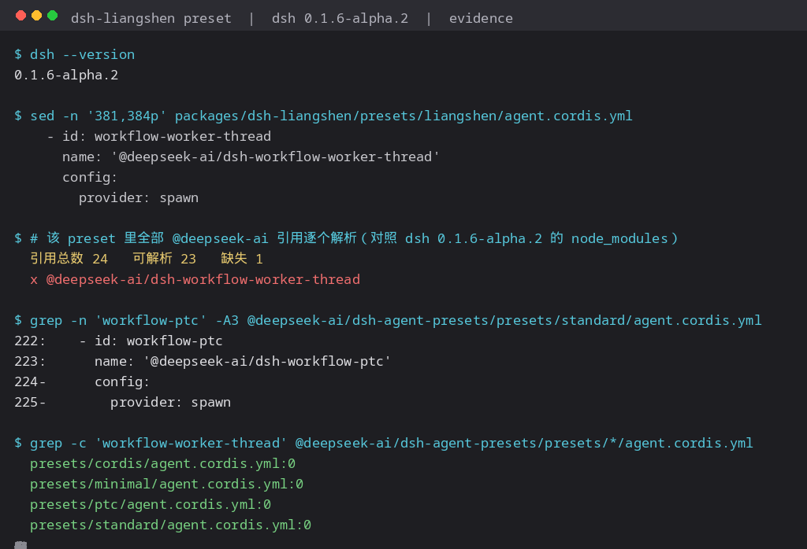

# patches

Two fixes that share nothing but the repository.

---

## liangshen-workflow-engine.patch

**Target:** `@linxin666/dsh-liangshen` — `presets/liangshen/agent.cordis.yml` (in the source repo:
`packages/dsh-liangshen/presets/liangshen/agent.cordis.yml`)
**Status: fixed upstream.** `0.4.0` (2026-09-23) replaced the row with `workflow-ptc`, exactly as this
patch does; `dev` and `main` no longer contain the bad name. **This patch is retained for 0.3.x only —
do not apply it to 0.4.x.**
**Verified against:** `0.3.23`/`0.3.24` (broken) and `0.4.1` (fixed) on `dsh@0.1.6-alpha.2`

The preset's roster names a workflow engine that does not exist:

```yaml
- id: workflow-worker-thread
  name: '@deepseek-ai/dsh-workflow-worker-thread'
```

`@deepseek-ai/dsh-workflow-worker-thread` was removed in dsh 0.1.6 and no released dsh ships it;
the engine that actually exists in the runtime is `@deepseek-ai/dsh-workflow-ptc`. The row is both
unresolvable and load-bearing: `tool-ralph` sits a few rows below, is enabled, and needs a workflow
engine to inject `workflowEngine`.

That this is the right engine is not a guess — dsh's own `standard` preset, which this roster is
derived from, uses exactly this row:

```yaml
# @deepseek-ai/dsh-agent-presets/presets/standard/agent.cordis.yml
- id: workflow-ptc
  name: '@deepseek-ai/dsh-workflow-ptc'
  config:
    provider: spawn
```

Of the **24** `@deepseek-ai/*` references in the pristine 0.3.24 preset, **23 resolve and exactly one
does not** — this row. Nothing else in the file is touched; the patch replaces those two lines.
None of dsh's four shipped presets (`cordis`, `minimal`, `ptc`, `standard`) contains the
string `workflow-worker-thread` even once.



### Apply

```bash
cd node_modules/@linxin666/dsh-liangshen
patch -p1 < /path/to/liangshen-workflow-engine.patch
```

Or edit the file directly and swap the row:

```yaml
- id: workflow-ptc
  name: '@deepseek-ai/dsh-workflow-ptc'
  config:
    provider: spawn
```

Keep it **enabled**. The shipped `ptc` preset carries the same row with `disabled: true`, but only
because `tool-ralph` is off by default there — its own comment says to restore the two together.
In this preset `tool-ralph` is enabled, so the engine has to be too.

### After the fix, re-sync the preset

The plugin copies its preset into `$DSH_HOME/.agent-presets/liangshen/` when it mounts, and that copy
is what sessions actually read. Patch the packaged file **and** refresh the copy, or the old preset
keeps being used — and it is easy to misread that as "the fix did not work".

Mirror the whole directory rather than copying named files: between 0.3.23 and 0.3.24 the preset
gained `paging.mjs`, `tool-activate.mjs` and `working-context.mjs`, and dropped `custom-bash.mjs`.

```bash
PKG=node_modules/@linxin666/dsh-liangshen/presets/liangshen
SYNC=$DSH_HOME/.agent-presets/liangshen
for f in "$SYNC"/*; do [ -e "$PKG/$(basename "$f")" ] || rm -f "$f"; done   # prune extras
cp -f "$PKG"/* "$SYNC"/                                                     # refresh
diff -r "$PKG" "$SYNC" && echo synced
```

The plugin re-syncs on every mount, so this is only needed to take effect without a restart.

```text
Observed on the 0.4.1 upgrade (2026-09-24): the package on disk became 0.4.1 — a 450-line preset
plus the new fact-ledger.mjs and guard.mjs — while
$DSH_HOME/.agent-presets/liangshen/ still held the 421-line 0.3.24-era copy. The host had already
been restarted after the install, so only the copy was stale; the live preset was silently missing
two modules. The copy does not follow the package on its own.
```

### Re-applying after an upgrade

A plugin update reinstalls `node_modules` and brings the broken row back, so this fix has to be
re-applied. `apply-liangshen-workflow-engine-patch.mjs` (repository root) does both files at
once and is the durable copy to keep:

```bash
node apply-liangshen-workflow-engine-patch.mjs
```

It is idempotent, and self-verifying: it exits 0 only when the row is swapped in both copies,
the engine row is present/enabled and **no other line changed**.

Note that it swaps the row in place rather than mirroring the tree, which is deliberate. On a
host whose operator has changed the plugin's settings, the mirror snippet above is wrong:
`sync.ts` writes the operator's choices into the synced tree as an overlay, and the only
overlaid key is the `tool-catalog` row's `presentation`. Mirroring the packaged tree over the
synced one reverts `presentation` to the shipped default (`'both'`) until the next mount
re-applies the overlay. Swapping one row leaves every other line alone, and it lands the synced
copy exactly on `sync.ts`'s fixed point — `synced == render(source, overlay)` — so the plugin
reports the preset `current` instead of re-syncing the fix away. The script checks that
equality, against every profile's source, because several plugin versions can coexist behind
the one global synced copy.

### Reporting it upstream

Filed to the source repository (zhu1090093659/dsh-web — what the npm package's `repository` field
points at):

| Issue | Outcome |
| --- | --- |
| [#1650](https://github.com/zhu1090093659/dsh-web/issues/1650) | Auto-closed: submitted without the repo's issue form |
| [#1651](https://github.com/zhu1090093659/dsh-web/issues/1651) | Auto-closed by `issue-template-enforcer.yml` in the same 9-second window |

#1651 was a full template submission, and it **passes the enforcer's own regex**: replaying
`readSection()` from `.github/workflows/issue-template-enforcer.yml` against the live issue body
returns all nine required sections non-empty. The enforcer nevertheless reported every section
empty *and* the `bug` label missing, while the label had been applied one second before it ran.
The timeline (`created 13:44:58` → `labeled 13:45:05` → `closed 13:45:07`, ~9 s end to end) points
at the job reading `context.payload.issue` before the body and labels were attached, rather than at
a malformed report.

**Outcome: fixed upstream.** `0.4.0` (published 2026-09-23, three days after the report) carries the working row,
and `dev`/`main` are clean as of `80967197a7`. Neither issue received a human reply — both were
closed by the enforcer within seconds and an outside author cannot reopen them, so whether the
report contributed is unknown. The patch above remains useful only for pinning 0.3.x.

---

## A separate issue that looks like the same bug: the plugin mounting twice

Patching the preset is necessary but not sufficient — the package also has to be **mounted exactly
once**. This bit twice on the same host, in opposite directions:

```yaml
# in profiles/web/cordis.patch.yml
- insert:
    - id: liangshen-mode
      name: "@linxin666/dsh-liangshen"
```

That row exists because the package was once listed under `dependencies` but **not** in
`dsh.profile.bundles`, so its own bundle patch (which carries `id: liangshen`) never applied and
no row referenced the plugin at all — while a leftover `- id: liangshen` / `disabled: true` in the
same file suppressed anything that did.

Once the package is listed in `dsh.profile.bundles` again, its own patch applies, and that extra row
becomes a **second** loader row for one package — the "duplicate plugin enabled" condition the host
warns about in its "本机连接被占用 / 请检查是否重复启用了插件" message. The plugin then mounts twice and
its client surface registers twice.

The rule: **exactly one owner per package.** Prefer the bundle row (it is what the plugin manager
maintains); own the row in the user layer only while the package is missing from
`dsh.profile.bundles`. If you do own it there, use a different id from the bundle's, because
duplicate loader entry ids throw and break the host boot.

Check the composed tree, not the source files:

```bash
dsh --profile web --dump-config | grep -cE '^- id: liangshen'   # expect 1
```

---

## Lock hardening

The original contents of this repository — the native reclaim patch for
`@deepseek-ai/dsh-atomic-write` (`atomic-write-reclaim.patch` + `apply-atomic-write-patch.mjs`) and
the upgrade-surviving `lock-sweeper` plugin — are documented in the [README](../README.md).

